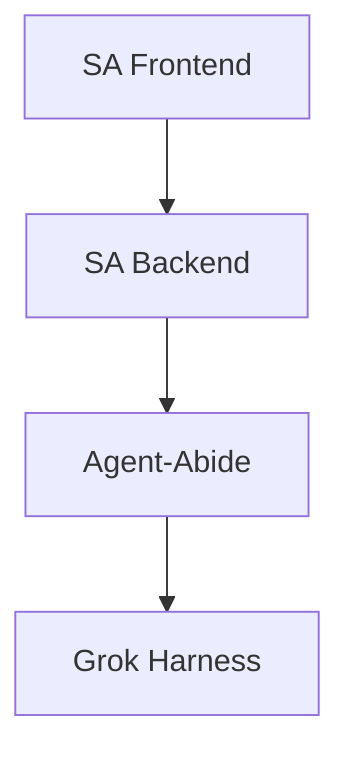

# Artifact Viewer

The artifact viewer is a panel in Socratic Arena that displays rich content — presentations, HTML pages, or any rendered output. Agents can create and update artifacts via the SA backend API.

## Quick Start: Presentations

The easiest way to use the artifact viewer is the slides endpoint. POST Markdown and get a Reveal.js presentation:

```bash
curl -X POST http://localhost:8000/api/artifacts/slides \
  -H "Content-Type: application/json" \
  -d '{
    "title": "My Presentation",
    "markdown": "# Slide 1\nHello world\n---\n# Slide 2\nMore content"
  }'
```

Slides are separated by `---` on its own line. The presentation renders live in the artifact viewer and auto-updates when you POST again.

### Python (from an agent)

```python
import requests

SA_PORT = 8000  # or 8002 for dev

requests.post(f"http://localhost:{SA_PORT}/api/artifacts/slides", json={
    "title": "Status Update",
    "markdown": """# Current Status

- B1-B9 complete
- 52/53 tests green

---

# Architecture



---

# Next Steps

1. Replay pipeline
2. Harness abstraction
"""
})
```

### Supported Content

Each slide supports standard Markdown plus:

| Feature | Syntax | Notes |
|---------|--------|-------|
| Headings | `# H1`, `## H2`, `### H3` | Gold-colored |
| Code blocks | ` ```python ... ``` ` | Syntax highlighted |
| Mermaid diagrams | ` ```mermaid ... ``` ` | Rendered client-side |
| KaTeX math | `$inline$` or `$$block$$` | LaTeX math notation |
| Tables | Standard Markdown tables | Auto-centered |
| Images | `` | Max height 60vh |
| Blockquotes | `> text` | Gold left border |

### Slide Separators

Use `---` on its own line (with blank lines around it) to separate slides:

```markdown
# First Slide

Content here

---

# Second Slide

More content
```

## API Reference

### Slides (recommended for agents)

| Method | Endpoint | Body | Purpose |
|--------|----------|------|---------|
| POST | `/api/artifacts/slides` | `{"markdown": "...", "title": "..."}` | Create or update presentation |
| GET | `/api/artifacts/slides` | — | Get current Markdown + slide count |
| DELETE | `/api/artifacts/slides` | — | Clear live presentation |

POST is idempotent — each call replaces the current presentation. The frontend reloads automatically via WebSocket broadcast (`artifact.updated` event).

### Generic Artifacts

For non-slide artifacts (raw HTML files in `backend/artifacts/`):

| Method | Endpoint | Body | Purpose |
|--------|----------|------|---------|
| GET | `/api/artifacts` | — | List all registered artifacts |
| POST | `/api/artifacts` | `{"type": "presentation", "filename": "...", "title": "..."}` | Register an artifact |
| GET | `/api/artifacts/{id}/content` | — | Serve artifact HTML file |

Artifact types: `"presentation"` or `"writeup"`. Files are served from `backend/artifacts/` directory.

## Port Selection

- **Prod**: port `8000` (`~/projects/socratic-arena/`)
- **Dev**: port `8002` (`~/projects/socratic-arena-dev/`)

Use whichever backend you're connected to.